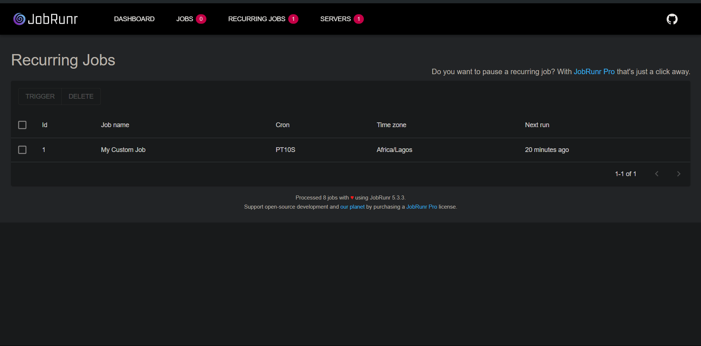

# jobRunr Example

### A sample project demonstrating how to use the [jobRunr](https://github.com/jobrunr/jobrunr) java library for scheduling persistent jobs in a spring boot application

<br>

### Usage:

1. Add the dependency jobRunr spring boot starter dependency
    ```kotlin
        implementation("org.jobrunr:jobrunr-spring-boot-starter:5.3.3")
    ```
2. Create a DataSource
   ```kotlin 
   @Bean
   //Returns a simple sqlite datasource
    fun dataSource(): DataSource {
        val dataSource = SQLiteDataSource()
        dataSource.url = "jdbc:sqlite:db.sqlite"
        return dataSource
    }
   ```
3. Configure the scheduler
   ```kotlin
    @Bean
    fun jobRunrScheduler(dataSource: DataSource, jobActivator: JobActivator): JobScheduler {
        val scheduler: JobScheduler = JobRunr.configure()
            .useStorageProvider(SqLiteStorageProvider(dataSource))
            .useJobActivator(jobActivator)
            .useBackgroundJobServer()
            .useDashboard(7070)
            .initialize()
            .jobScheduler
        return scheduler
    }
   
   ```
4. Schedule your jobs
   ```kotlin
   @Service
   class MyCustomRecurringJob(
   private val scheduler: JobScheduler
   ) {
   private val logger = LoggerFactory.getLogger(javaClass)
   
       // We use a PostConstruct annotation on a function we want to run after the application starts up
       @PostConstruct
       fun scheduleMyCustomJob() {
           val jobData = "My job data"
           val jobId = "1"
   
           startMyJob(jobId, jobData)
       }
       
       /*
        Use the scheduler to schedule a recurrent job (can be other types like one-time job).
        The job logic in run inside the lambda, which  executes at most, 1 function
        */
       fun startMyJob(jobId: String, jobData: String) {
           scheduler.scheduleRecurrently(jobId, Duration.ofSeconds(10)) {
               myJob(jobData)
           }
       }
   
       // The actual job logic, we use the job annotation to Provide a name and configure retries in case of failures
       @Job(name = "My Custom Job", retries = 3)
       fun myJob(jobData: String) {
           logger.info("running job with custom job data -> $jobData")
       }
   }

   ```

<br>

### Optional: Use the configured dashboard to manage jobs
The dashboard port can be configured when creating the scheduler:
   ```kotlin
      val scheduler: JobScheduler = JobRunr.configure()
                  .useDashboard(7070)
   ```
  

